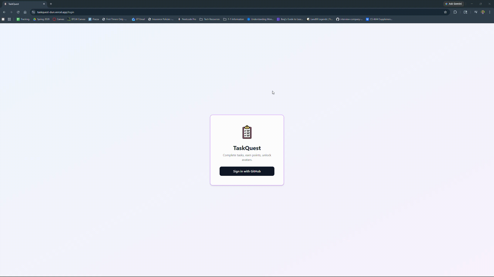

# TaskQuest: A Fun Task-Tracking Application!

CodePath WEB103 Final Project

Designed and developed by: Archie Goli

🔗 Link to deployed app: https://taskquest-dun.vercel.app/

## About

### Description and Purpose

TaskQuest is a gamified to-do app that turns everyday productivity into a rewarding experience. Users can create, manage, and complete tasks across different categories. Every completed task earns points, and those points can be spent in the Avatar Shop to unlock unique avatars that personalize the user's profile. The purpose is to make task management more engaging and motivating by tying real progress to visible, fun rewards.

### Inspiration

I always have a hard time keeping track of tasks for school and work. Most to-do apps feel like a chore in themselves — there's no sense of progress or reward beyond just checking a box. I wanted to build something that makes getting things done feel genuinely satisfying, where the more you accomplish, the more avatars you unlock.

## Tech Stack

**Frontend:** React, React Router

**Backend:** Node.js, Express, PostgreSQL

## Features

### Task Management ✅

Users can create, view, edit, and delete tasks. Each task has a title, description, due date, category, and completion status — giving full control over what needs to get done.


### Points Reward System ✅

Every time a user marks a task as complete, they automatically earn points. Points are tracked on the user's profile and serve as the in-app currency for unlocking avatars.

[gif goes here]

### Avatar Shop ✅

Users can browse a collection of avatars and spend their earned points to unlock them. Locked avatars display their point cost, and unlocked avatars can be equipped to the user's profile.

[gif goes here]

### User Profile ✅

A dedicated profile page displays the user's current avatar, total points earned, number of tasks completed, and all avatars they have unlocked so far.



### Task Categories ✅

Tasks can be assigned to a category (e.g., School, Work, Personal, Health). Categories help users organize their workload and provide a visual way to group related tasks.


### Task Filtering and Sorting ✅

Users can filter their task list by category or completion status, and sort by due date or creation date. This makes it easy to focus on what matters most at any given time.

[gif goes here]

### Database Reset ✅

Users can reset the app's database back to its default state, restoring the original set of tasks, avatars, and points for a fresh start.

[gif goes here]

## Installation Instructions
Below are some instructions to set up the project locally.

### Prerequisites
- Node.js (v18+)
- A PostgreSQL database (e.g. via [Render](https://render.com))
- A GitHub OAuth App ([create one here](https://github.com/settings/developers))

### 1. Clone the repository
```bash
git clone https://github.com/archishmagoli/taskquest.git
cd taskquest
```

### 2. Set up the backend
```bash
cd server
npm install
```

Create a `.env` file in the `server/` directory:
```
PGHOST=your_db_host
PGUSER=your_db_user
PGPASSWORD=your_db_password
PGDATABASE=your_db_name
PGPORT=5432
GITHUB_CLIENT_ID=your_github_client_id
GITHUB_CLIENT_SECRET=your_github_client_secret
GITHUB_CALLBACK_URL=http://localhost:3000/auth/github/callback
SESSION_SECRET=any_long_random_string
CLIENT_URL=http://localhost:5173
```

Seed the database:
```bash
npm run seed
```

Start the backend:
```bash
npm run dev
```

### 3. Set up the frontend
```bash
cd ../client
npm install
npm run dev
```

The app will be available at `http://localhost:5173`.
