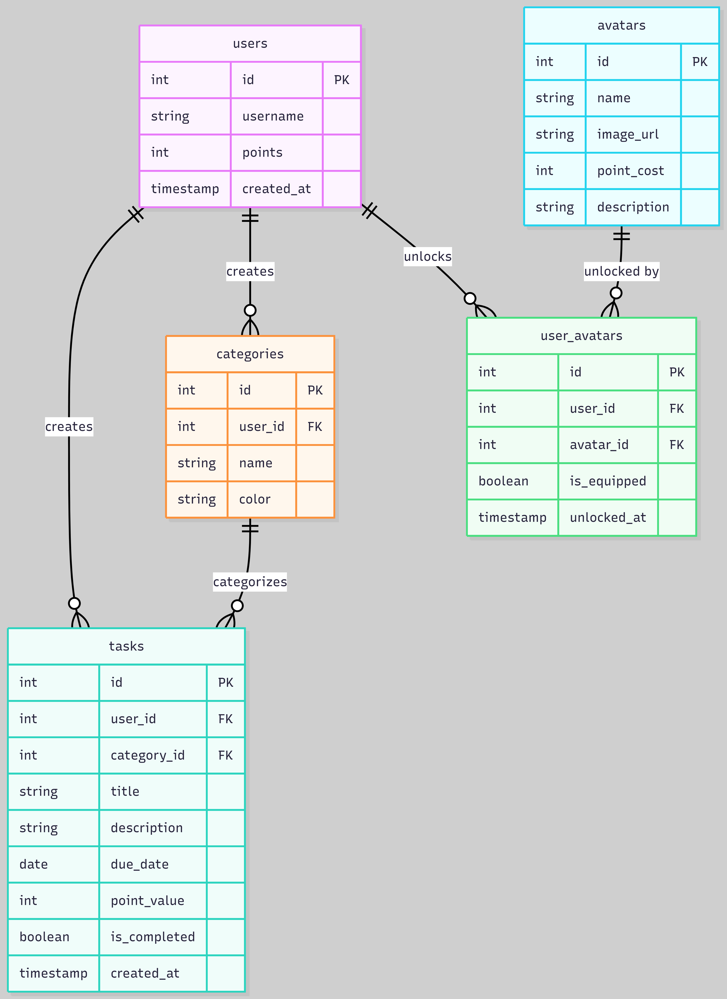

# Entity Relationship Diagram

Reference the Creating an Entity Relationship Diagram final project guide in the course portal for more information about how to complete this deliverable.

## Create the List of Tables
- **users** — stores each user's profile, including their current point total
- **tasks** — stores tasks created by a user, including title, description, due date, point value, completion status, and category
- **categories** — stores user-created categories (e.g. School, Work, Personal) used to organize tasks
- **avatars** — stores all available avatars in the shop, including name, image, and point cost to unlock
- **user_avatars** — join table linking users to the avatars they have unlocked; includes an `is_equipped` field to track which avatar is currently active on the user's profile

## Add the Entity Relationship Diagram
The Entity Relationship Diagram for the application is below:

