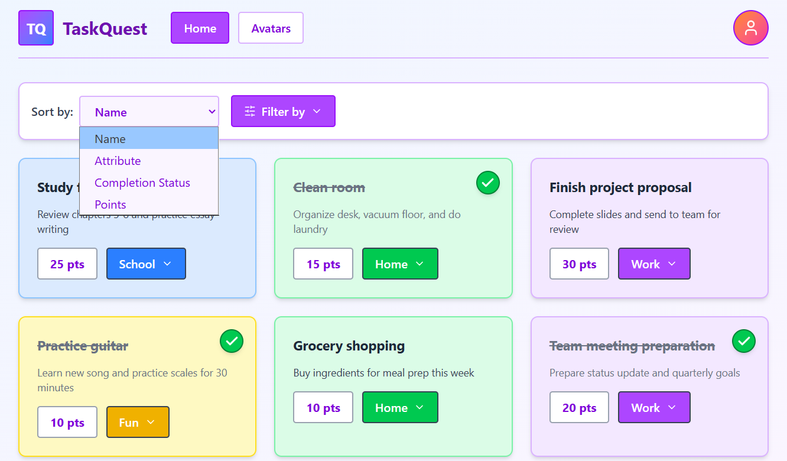
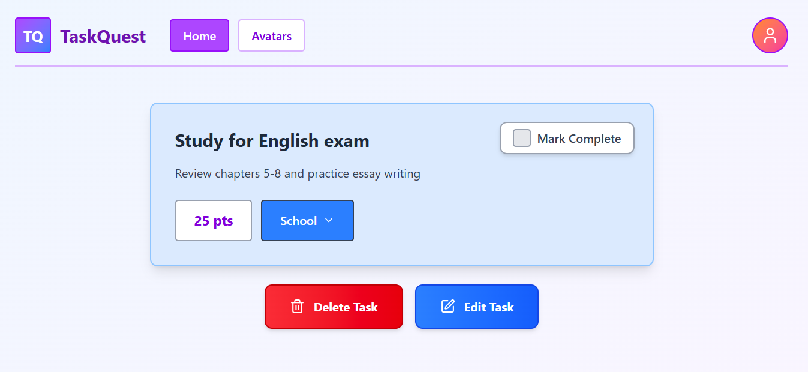
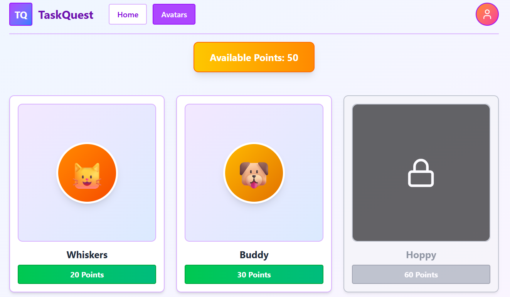

# Wireframes
Reference the Creating an Entity Relationship Diagram final project guide in the course portal for more information about how to complete this deliverable.

## List of Pages
- ⭐ Home Page (Task List)
- ⭐ Task Detail Page
- ⭐ Avatars Page (Avatar Shop)
- User Profile Page
- Avatar Detail Page

## Wireframe 1: Home Page
Contains a list of tasks the user has created. User can sort or filter tasks as desired, and each task has an associated point value, description, and completion status.

## Wireframe 2: Task Detail Page
When a user clicks into a task, this is the detail they will see. They can mark the task as complete, edit other task details, or even delete the task.

## Wireframe 3: Avatars Page
When users earn points after completing tasks, they can purchase and unlock new avatars! For avatars available but unpurchased, users will see a "Purchase" button. In this case, the user has already unlocked Whiskers and Buddy, but they have yet to unlock Hoppy (went with a pet theme here, may change it in the final product)!

[👉🏾👉🏾👉🏾 include wireframe 3]